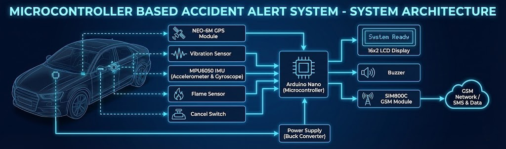

<!-- Repository Banner -->
<p align="center">
  
</p>

---

## 🔹 Overview
A microcontroller-based system for **accident detection**, **location tracking**, and **automatic emergency alerts**. The device identifies collisions, rollovers, and fires, determines driver-carelessness level, and sends real-time GPS coordinates to emergency services via GSM. 
>See the demo video below for a quick visual explanation of how the system works.
<p align="center">
  
</p>
 
>Full system description referenced from project documentation.

---

## 🔹 Features
- **Accident Detection:** Collision, rollover, and fire sensing  
- **Driver Carelessness Assessment:** Based on activation order  
- **GPS Tracking:** Real-time location via NEO-6M  
- **GSM Alerts:** SMS sent to emergency units with:
  - Accident type  
  - Google Maps link  
  - Driver-carelessness note  
- **Cancel Switch:** 5–15 second safety window  
- **LCD Display:** Status, alerts, and countdown  
- **Kalman Filtering:** IMU smoothing for accurate rollover detection

---

## 🔹 Hardware Components
- Arduino Nano (ATmega328P)  
- MPU6050 IMU (Accelerometer + Gyroscope)  
- Vibration/Knock Sensor  
- Flame Sensor  
- NEO-6M GPS Module  
- SIM800C GSM Module  
- LM2596 Buck Converter  
- 16×2 LCD (I2C)  
- Buzzer, LEDs, Push Button  

---

## 🔹 Architecture

<p align="center">
  
</p>

>**Architecture Summary**
1. Detect accident via IMU, knock, and flame sensors  
2. Identify accident type  
3. Fetch location from GPS  
4. Countdown (5–15s) displayed on LCD  
5. User may cancel non-critical alerts  
6. GSM sends emergency SMS with:
   - Accident category  
   - Carelessness remark  
   - GPS Google Maps link  
7. Audible/visual alerts through buzzer + LEDs  

---

>### 🧩 Accident Severity & Delay Logic
| Collision | Rollover | Fire | Delay |
|----------|----------|------|--------|
| Yes | No | No | 15s |
| No | Yes | No | 15s |
| Yes | No | Yes | 10s |
| No | Yes | Yes | 10s |
| Yes | Yes | No | 5s |
| Yes | Yes | Yes | 5s |

---

## 🔹 Results Summary
- **Accident detection accuracy:** 100%  
- **GPS tracking accuracy:** 87%  
- **SMS delivery success:** 93%  
- Tested across multiple real-world road conditions

---

## 📁 Suggested Project Structure

>### ▶️ Getting Started

```bash
### 1️⃣ Upload Code
Open `accident_alert_system.ino` using Arduino IDE and install required libraries.

### 2️⃣ Assemble Hardware
Follow the wiring diagram for all sensor and module connections.

### 3️⃣ Power the System
Regulated 5V supply using LM2596 converter.

### 4️⃣ Test Scenarios
Simulate:
- Collision (knock)
- Rollover (IMU orientation)
- Fire (flame sensor)

Confirm countdown + SMS behavior.
```

---

## 🔹 Sensor Filtering (IMU)
A Kalman filter was used to reduce noise in:
```bash
- Roll  
- Pitch  
- Yaw  
```
This provides more accurate rollover detection.

---

## 🚧 Known Limitations
- Initial GPS fix may take 2–3 minutes  
- GSM reliability varies by signal strength  
- IMU drift under long operation  
- Requires mobile network coverage  

---

## 🔹 Future Improvements
- Add camera module for visual confirmation  
- Integrate heart-rate, alcohol, or drowsiness sensors  
- Cloud-connected IoT dashboard  
- AI/ML accident severity classification  
- Vehicle-to-Cloud (V2C) link for smart mobility  

---

## 🔹 License & Citation
```bash
Apache License  
Version 2.0, January 2004  
http://www.apache.org/licenses/
```
- **If you use this work in any form—academic, research, educational, or practical—please cite it as:**
```bash
Kasthuriarachchi, S.D., 2023. Vehicle-Accident-Alert-System. [Online] Available at:
https://github.com/sadeep654/Vehicle-Accident-Alert-System
(Accessed: date-you-accessed).
```

---

## 📩 Contact
Feel free to explore, fork, or reach out for collaboration or opportunities.
